# Design

## Agent Workflow Diagram

```mermaid
flowchart TD
    subgraph "Multi-Agent System"
        Orchestrator[Orchestrator Agent\nRoutes & Orchestrates]
        OrderProcessorAgent[Order Processor Agent\nParse and understand customer request]
        QuotingAgent[Quoting Agent\nGenerates competitive quotes]
        InventoryAgent[Inventory Agent\nAnswers stock queries & manages reorders]
        SalesAgent[Sales Agent\nFinalizes transactions]

        subgraph OrchestratorWorkflow["Orchestrator Workflow"]
            Orchestrator --> process_order_info
            Orchestrator --> generate_quote
            generate_quote --> ow_get_inventory_items_by_name[get_inventory_items_by_name]
            Orchestrator --> manage_inventory
            Orchestrator --> handle_sale
            process_order_info -.-> generate_quote
            generate_quote -.-> manage_inventory
            manage_inventory -.-> handle_sale
            Orchestrator --> generate_financial_report
        end

        subgraph WorkerAgents["Worker Agents"]
            process_order_info --> OrderProcessorAgent
            generate_quote --> QuotingAgent
            manage_inventory --> InventoryAgent
            handle_sale --> SalesAgent
        end

        subgraph OrderProcTools["Order Processor Agent Tools"]
            OrderProcessorAgent --> opa_get_all_item_names[get_all_item_names]
            OrderProcessorAgent --> get_current_date
        end

        subgraph QuotingTools["Quoting Agent Tools"]
            QuotingAgent --> search_quote_history
        end

        subgraph InventoryTools["Inventory Agent Tools"]
            InventoryAgent --> analyze_order_stock_requirements
            InventoryAgent --> order_shortage_from_supplier
            InventoryAgent --> replenish_to_minimum
            InventoryAgent --> get_all_inventory
            analyze_order_stock_requirements --> get_inventory_items_by_name
            analyze_order_stock_requirements --> get_stock_level
            analyze_order_stock_requirements --> get_supplier_delivery_date
            order_shortage_from_supplier --> get_cash_balance
            order_shortage_from_supplier --> ia_create_transaction[create_transaction]
            replenish_to_minimum --> ia_create_transaction[create_transaction]
        end

        subgraph SalesTools["Sales Agent Tools"]
            SalesAgent --> sa_create_transaction[create_transaction]
        end
    end

    CustomerInput([Customer Request]) --> Orchestrator
    Orchestrator --> SystemOutput([System Response])

    subgraph "Data Source"
        SQLiteDB[("SQLite Database\n(munder_difflin.db)")]
    end

    ow_get_inventory_items_by_name --> SQLiteDB
    generate_financial_report --> SQLiteDB
    opa_get_all_item_names --> SQLiteDB
    search_quote_history --> SQLiteDB
    get_all_inventory --> SQLiteDB
    get_inventory_items_by_name --> SQLiteDB
    get_stock_level --> SQLiteDB
    get_cash_balance --> SQLiteDB
    ia_create_transaction --> SQLiteDB
    sa_create_transaction --> SQLiteDB
    
    Orchestrator:::agent
    OrderProcessorAgent:::agent
    QuotingAgent:::agent
    InventoryAgent:::agent
    SalesAgent:::agent
    
    process_order_info:::tool
    generate_quote:::tool
    ow_get_inventory_items_by_name:::tool
    manage_inventory:::tool
    handle_sale:::tool
    opa_get_all_item_names:::tool
    get_current_date:::tool
    search_quote_history:::tool
    analyze_order_stock_requirements:::tool
    order_shortage_from_supplier:::tool
    replenish_to_minimum:::tool
    get_inventory_items_by_name:::tool
    get_stock_level:::tool
    get_supplier_delivery_date:::tool
    get_cash_balance:::tool
    ia_create_transaction:::tool
    sa_create_transaction:::tool
    
    SQLiteDB:::db
    
    style OrchestratorWorkflow stroke: #D50000, stroke-width: 3px
    style WorkerAgents stroke: #FF991C, stroke-width: 3px
    style OrderProcTools stroke: #6B6BFF, stroke-width: 2px
    style QuotingTools stroke: #6B6BFF, stroke-width: 2px
    style InventoryTools stroke: #6B6BFF, stroke-width: 2px
    style SalesTools stroke: #6B6BFF, stroke-width: 2px
    
    classDef agent fill: #e1f5fe, stroke: #03a9f4, stroke-width: 2px
    classDef tool fill: ##D3D3FF, stroke: ##7676FF, stroke-width: 1px
    classDef db fill: #e8f5e9, stroke: #4caf50, stroke-width: 2px
```



### Orchestrator Agent Responsibilities
* **Sequential Coordination:** Manage the multi-step order lifecycle by calling specialized tools in sequence.
* **Data Propagation:** Ensure quote details and delivery dates are passed correctly between agents.
* **Response Aggregation:** Synthesize the results from all agent steps into a single, cohesive response for the customer.

### Order Processor Agent Responsibilities
* Understand the user request and identify the necessary elements for order processing
* Validate the input elements
* Transform the request into a structured object

### Quoting Agent Responsibilities
* Generate a pricing quote for an order item
* Apply discounts based on historical generated quotes

### Inventory Agent Responsibilities
* Validate projected stock levels to fulfill orders
* Replenish stock levels to fulfill orders
* Replenish stock levels to keep required minimums

### Sales Agent
* "Finalize" sales by creating sales transactions 

## Workflow Sequence for Purchase Order processing
1. **Orchestrator** agent receives the user prompt and begins the workflow
2. **Orchestrator** requests the **Order Processing Agent** to parse and understand the user prompt to identify the necessary elements to handle the purchase order:
   - Order Delivery Date
   - Order Request Date: date at which the order is placed
   - Item-quantity pairs
   - Metadata: customer mood and job, order size and event type  
3. For each item in the order, the **Orchestrator** requests the **Quoting Agent** to generate a quote.
   - Before calling the agent, the `generate_quote` tool gets the price from `inventory` table and passes it in the prompt to the Quoting Agent if present 
   - The **Quoting Agent** uses the `search_quote_history` with the item name to identify unit price and apply at-will discounts  
   - The **Quoting Agent** returns a quote calculation breakdown along with a human-readable response
   - The **Orchestrator** aggregates all individual item quotes into a single Order Quote
4. The **Orchestrator** calls the **Inventory Agent** to handle the inventory
   - The **Inventory Agent** uses the `analyze_order_stock_requirements` tool to know whether the order can be fulfilled in time based on ordered quantities, projected stock levels and shortage coverage deliverability from the supplier
   - If the order is fulfillable, the **Inventory Agent** uses the `order_shortage_from_supplier` to create the necessary the `stock_orders` transactions to cover any shortages to fulfill the order
   - Finally, the **Inventory Agent** uses the `replenish_to_minimum` tool to replenish any pertinent item up to its minimum stock level
5. For each item in the order, the **Orchestrator** calls the **Sales Agent** to finalize the order purchase
   - The **Orchestrator** passes the quoted prices
   - The **Sales Agent** just uses the `create_transaction` tool to create a `sales` transaction for the order item with the given values
   - The **Orchestrator** aggregates all individual results
6. The aggregator generates a response and returns it


### Request flow example (simplified)

User input:
> I want to order 500 A4 paper, 300 cardstock, 200 washi tape. Deliver by `X`. (Date of request: `Y`)

1. **orchestrator_agent** --> call Tool `process_order_info(customer_message)`
   - `process_order_info` --> `order_processor_agent.run_sync("Extract info from this user request {customer_message}")`
   - **order_processor_agent** returns `CustomerRequestDetails`
      ```json
      {
        "items": {
          "A4 paper": 500,
          "cardstock": 300,
          "washi tape": 200, 
        },
        "delivery_date": "X",
        "request_date": "Y",
        "request_metadata": {...}
     }
      ```
2. **orchestrator_agent** --> call Tool `generate_quote(items)`
   - `generate_quote` --> (For each item in the order) `quoting_agent.run_sync("Generate a quote for this item & quantity {item_name}, {quanitty})`
   - **quoting_agent** returns `ItemQuote`
      ```json
      {
        "quote_calculation": { item_name, quanity, unit_price, base_amount, discount_rate, total },
        "quote_explanation": "Human-readable explanation of pricing with discount"
      } 
      ```
   - **`generate_quote`** --> Aggregate and return `OrderQuote`
      ```json
      {
        "item_quotes": [...],
        "base_total": sum(item_base_total),
        "total_amount": sum(total_amount)
      }
      ```
3. **orchestrator_agent** --> call Tool `manage_inventory(order_quote_data, delivery_date, request_date)`
   - `manage_inventory` --> `inventory_agent.run_sync("Handle the inventory for this order. {order_quote_data}, {delivery_date}, {request_date)"`
   - **inventory_agent** returns `InventoryAgentOutput`
     ```json
     {
        "placed_transactions": [...],
        "messages": [...]
     }
     ```
4. **orchestrator_agent** --> call Tool `handle_sale(order_quote_data, delivery_date, request_date)`
   - `handle_sale` --> (For each item in the order) `sales_agent.run_sync("Record the sale transaction for this order item {item_data}")`
   - **sales_agent** returns `SalesAgentOutput`
   ```json
      {
        "placed_transactions": [...],
        "messages": [...]
      }
   ```
   - `handle_sale` --> Aggregate results
5. **orchestrator_agent** --> Produce a response