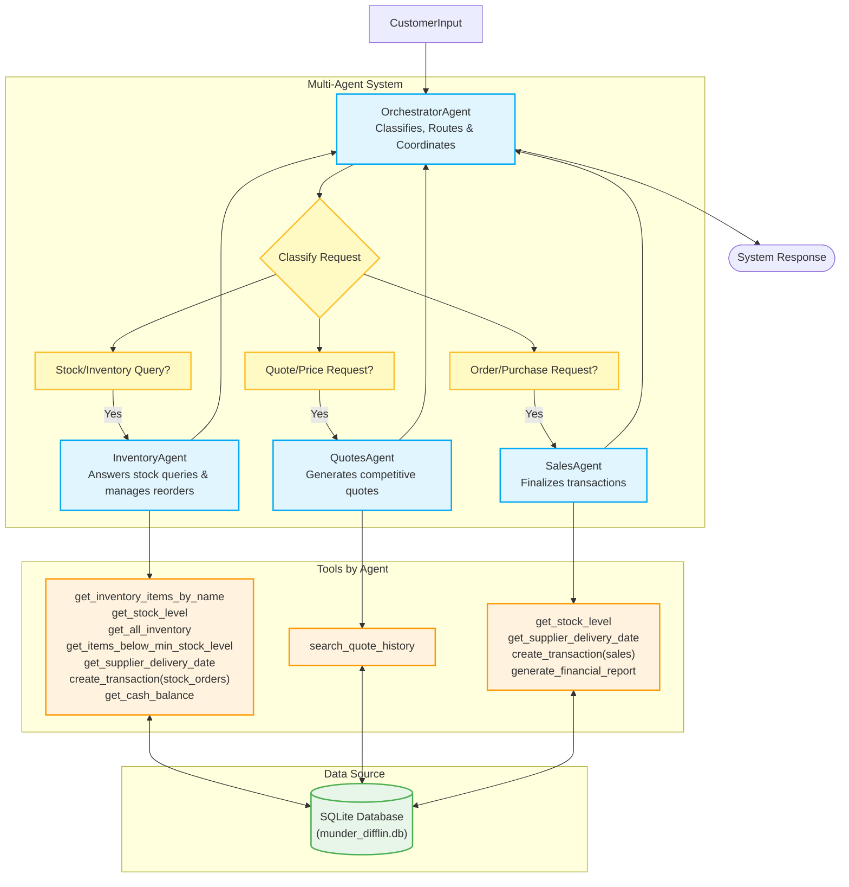

# Agent Workflow Diagram

## Orchestrator Responsibilities
- Request Classification: Determine if input is: stock query, quote request, or order request
- Routing: Send to InventoryAgent (stock), QuotesAgent (pricing), SalesAgent (fulfillment)
- State Coordination: Track cash balance & inventory state across agent calls (shared FactoryState pattern from l6)
- Multi-step workflows: For orders: InventoryAgent → check stock → QuotesAgent → price → SalesAgent → fulfill
- Error Handling: Handle insufficient inventory, low cash, unavailable items
- Response Aggregation: Combine agent outputs into coherent customer response

### Request examples
- Example: "what is the current stock of paper plates"
  - Type: Stock / Inventory query
  - Handled by: Inventory Agent

- Example: "I need 500 sheets of glossy paper"
  - Type: Quote Request 
  - Handled by: Quotes Agent

- Example: "I would like to place an order for..."
  - Type: Order purchase
  - Handled by: Sales Agent

- Example: "500 A4 paper, 300 cardstock, 200 washi tape"
  - Type: Complex multi-item
  - Handled by: Orchestrator --> Inventory Agent (check stock) --> Quotes Agent (price) --> Sales Agent (fulfill)

