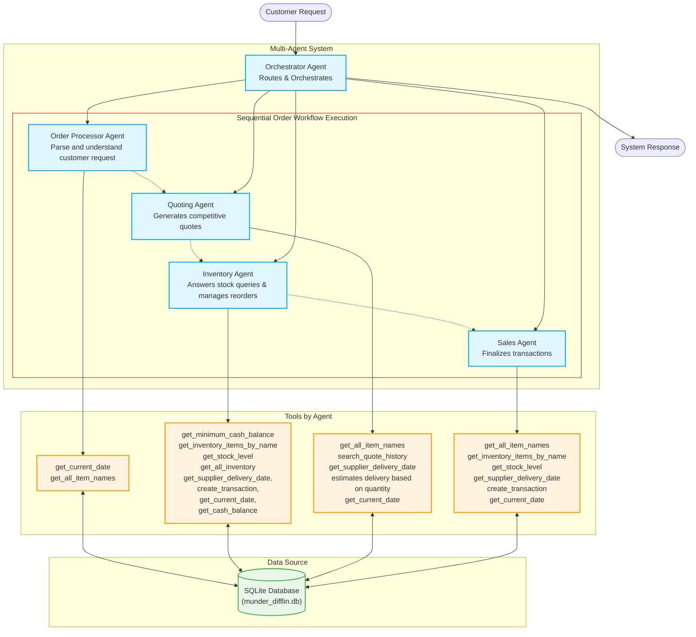

# Agent Workflow Diagram

## Orchestrator Responsibilities
* **Sequential Coordination:** Manage the multi-step order lifecycle by calling specialized tools in sequence.
* **Data Propagation:** Ensure quote details and delivery dates are passed correctly between agents.
* **Response Aggregation:** Synthesize the results from all agent steps into a single, cohesive response for the customer.

**Workflow Sequence for Orders:**
OrderProcessingAgent: Parse and understand the customer request.
QuotingAgent: Price items and provide a formal quote.
InventoryAgent: Verify stock levels and execute replenishment if below minimums.
SalesAgent: Fulfill the order and update the financial ledger.

### Request examples
- Example: "what is the current stock of paper plates"
  - Type: Stock / Inventory query
  - Handled by: Inventory Agent

- Example: "I need 500 sheets of glossy paper"
  - Type: Quote Request 
  - Handled by: Quotes Agent

- Example: "I would like to place an order for..."
  - Type: Order purchase
  - Handled by: Sales Agent

- Example: "500 A4 paper, 300 cardstock, 200 washi tape"
  - Type: Complex multi-item
  - Handled by: Orchestrator --> Order Processor Agent --> Quoting Agent (pricing) --> Inventory Agent (stock keeping) --> Sales Agent (fulfill)

